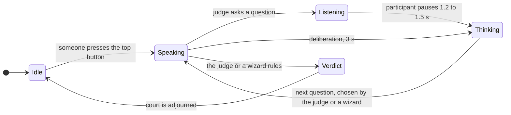

# Chatterboxes: Tiny Court of Everyday Disputes

**Collaborators:** Hong Yuan Cao (hc2343), Yun-Chung Liu (yl4445)

A speech-enabled Raspberry Pi judge for small everyday disputes. Part 1 explores voice and turn-taking; Part 2 implements the Mini Judge with a screen, a start button, and a wizard controller.

# Part 1

## A. Text to Speech

Our greeting script: [greet_my_name.sh](speech-scripts/greet_my_name.sh).

I used the same Piper voice as the demo for my greeting script: both sounded natural and conversational. However, compared with Piper, eSpeak and Festival sounded much more robotic. Even with the same words, the Piper greeting felt more like a person checking in with me, while the other two felt more like a machine delivering a message.

## B. Speech to Text

For my five-second recording, base.en took 0.72 seconds to load and 1.96 seconds to transcribe, with a real-time factor of 0.39x. small.en took 197.03 seconds to load and 5.66 seconds to transcribe, with a real-time factor of 1.13x. Both produced the same words, with only a punctuation difference. The small model’s startup wait was especially noticeable. Although loading happens only once in a continuously running system, its transcription was also slower without improving accuracy on this recording. I would easily choose base.en for faster startup and conversational responses.


My script uses Piper to ask “How many coffees did you drink today?” and then records a five-second response. Testing with base.en produced the transcript “1,” taking 1.66 seconds with a real-time factor of 0.33x.

Numerical-input script: [ask_number.sh](speech-scripts/ask_number.sh). Transcription was run separately with [transcribe.py](speech-scripts/transcribe.py).

## C. Turn-taking

We used [listen.py](speech-scripts/listen.py) to compare silence thresholds.

### Our observations

We tested silence thresholds of 0.2s, 0.4s (the default), and 1.5s using `listen.py`. These runs used the script's default `tiny.en` recognition model.

At 0.2s, the system often split our speech into short fragments instead of capturing full sentences. Pausing within a sentence could end the turn before we finished our thought, making it difficult to speak naturally. The intermediate 0.4s setting also produced many short fragments, so it did not fully solve this problem. At 1.5s, the system captured longer phrases, including hesitations and changes of thought, but required a longer wait before deciding we were finished. This gives the speaker more room to think, at the cost of making the system seem slower to respond.

We also noticed that the beginning of our speech was often missing at both short and long settings. Increasing the end-of-turn silence threshold did not resolve that observation. The transcripts alone cannot establish whether the first words were lost during audio capture, speech detection, or recognition; we would need the original audio and intended words to identify the cause.

**0.2s minimum silence:**

```text
[0.5s speech, 0.86s to transcribe]  Hello.
[0.6s speech, 0.91s to transcribe]  Are you doing?
[0.8s speech, 0.84s to transcribe]  the microphone.
[1.1s speech, 4.64s to transcribe]  We have some one refill.
[0.4s speech, 0.75s to transcribe]  Yeah.
```

**0.4s minimum silence (default):**

```text
[0.7s speech, 0.80s to transcribe]  Hello.
[0.4s speech, 0.80s to transcribe]  you.
[0.7s speech, 0.78s to transcribe]  Are you?
[0.5s speech, 0.82s to transcribe]  Eric.
[0.8s speech, 0.89s to transcribe]  How was your day?
[0.4s speech, 0.79s to transcribe]  Why?
[0.6s speech, 3.99s to transcribe]  y'all.
[1.2s speech, 6.31s to transcribe]  We will see you next time.
[0.5s speech, 0.86s to transcribe]  doesn't work.
```

**1.5s minimum silence:**

```text
[2.7s speech, 1.23s to transcribe]  And I think... No, no, I don't think I'll talk about it either.
[2.6s speech, 1.10s to transcribe]  I think I should know maybe it's September 28th something like that
[2.7s speech, 1.18s to transcribe]  That's true, we're looking at I think it's a number of times
[4.4s speech, 1.07s to transcribe]  very cool. What if I don't think that?
[1.3s speech, 0.83s to transcribe]  the air.
[0.6s speech, 0.88s to transcribe]  hungry.
[3.9s speech, 1.01s to transcribe]  very very hungry I need to eat food
[0.5s speech, 0.82s to transcribe]  No.
```

## D. Storyboard

### Tiny Court of Everyday Disputes

Our device hears small everyday complaints and gives humorous verdicts. The storyboard shows a student complaining about a roommate returning an almost-empty milk carton to the fridge. Read the panels from left to right across the top row, then the bottom row.


### Design process

We explored playful speech-device ideas and chose a tiny courtroom because it gives people a clear reason to speak while leaving room for unexpected answers.

We organized the interaction into six steps: hearing the complaint, gathering evidence, confirming understanding, asking for a solution, deliberating, and delivering a verdict. The confirmation step lets the user correct a misunderstanding before the judge decides. The milk case is one possible conversation; during role-play, the judge can follow the same structure while adapting its questions to the participant's own complaint.

### Dialogue and pauses

1. **Hear the complaint.** The judge asks, “What is your complaint?” The user answers, “My roommate left one drop of milk!” The device waits for **1.5 seconds of silence** after the answer.
2. **Gather evidence.** The judge asks, “How much left?” The user replies, “Enough for one cornflake.” The device again waits for **1.5 seconds of silence**.
3. **Confirm understanding.** The judge asks, “Almost empty, but put back?” The user says, “Yes.” For this short confirmation, the device waits for **0.8 seconds of silence**. If the user starts explaining a correction, the intended behavior is to allow the longer 1.5-second pause instead.
4. **Ask for a solution.** The judge asks, “What would make this right?” The user answers, “They should buy the next carton.” The device waits for **1.5 seconds of silence**, allowing room for a brief pause while thinking through an answer.
5. **Deliberate.** The judge says, “Considering this dispute,” and displays “Thinking…” during a deliberate **three-second pause**.
6. **Deliver the verdict.** The judge announces, “One replacement carton. Justice for cereal!” The user responds, “Yay!” The device displays the verdict.

Our listening pauses are informed by Part C, where short silence thresholds often split our speech into fragments. We chose 1.5 seconds for open-ended answers so users have more room to hesitate, and 0.8 seconds as an initial setting for a short confirmation. These thresholds measure silence after speech, not the total time allowed for an answer. The separate three-second deliberation pause creates suspense, while “Thinking…” explains why the device has not replied yet. These are proposed timings to test and adjust during the role-play, and for when we actually build this out.

## E. Acting out the dialogue

[Watch our role-play recording](role-play.mp4).

When acting as the device, I sometimes waited a little longer than the planned 1.5 seconds after my partner finished speaking. This made the conversation feel a little more awkward than I had imagined because the gaps between turns were too long. I think an accurately timed 1.5-second silence threshold would feel more natural, although we still need to test it on the actual device, where speech processing could add further delay.


# Part 2: Mini Judge

### Our redesign: the Mini Judge

**1. What we improved**

- **Wording.** Our Part 1 questions were clipped. "How much left?" and "Almost empty, but put back?" only make sense if you already know the milk story. Every question now names what it is asking about, like "Did your roommate ask before taking the charger?", so a stranger can follow it.
- **Timing.** In Part 1 we planned 0.8 seconds of silence to end a yes or no answer. The implemented script increases this to allow more room for an explanation. Yes or no questions now wait 1.2 seconds, and open questions keep 1.5 seconds. The 3 second deliberation stays as a deliberate suspense effect, but the screen now says THINKING so it does not look like the device froze.
- **Misunderstandings.** The wizard has recovery lines one click away, like "Could you say that again?" and "The court did not catch that. Please answer yes or no." The confirmation step also repeats the complaint back before any verdict, so a wizard can ask follow-up questions when something was misheard. In autonomous mode, confirmation is a scored yes/no answer rather than a rewrite of the complaint.
- **Scope.** Part 1 had one scripted milk case with a fixed ending. The judge now hears three kinds of dispute (a borrowed charger, eaten food, and uneven chores), and each has three possible verdicts (unfair, fair, or split), so the ruling depends on what the participant actually says.

**2. Beyond speech: how you know whose turn it is**

The Mini PiTFT is the turn signal. Every state has its own color and title, so you can tell at a glance whether it is your turn to talk:

| Screen | Color | Meaning |
|---|---|---|
| MINI JUDGE | navy | waiting for someone to press the button |
| THE JUDGE | amber | the judge is talking, and its words are shown |
| LISTENING | green | your turn; pause when you are done |
| THINKING... | purple | the judge is working on your answer |
| UNFAIR / FAIR / SPLIT | red / blue / gray | the verdict |

The verdict colors never reuse a turn color, so a FAIR verdict is not mistaken for LISTENING. We used the whole screen rather than a single LED because labels alongside colors help distinguish the states, and showing the judge's words helps when the speaker is hard to hear.

The **top button** replaces a wake word. Pressing it opens court, so nobody has to guess what to say to wake the judge up. A press only counts between cases: one in the middle of a case is ignored, so it cannot start a second case by accident.

**3. New diagram and script**



Every line the judge can say is in [cases.py](mini_judge/cases.py). Each case follows the six steps from our Part 1 storyboard: complaint, evidence, confirmation, remedy, deliberation, and verdict.

| Case | Evidence the judge asks for | Verdicts |
|---|---|---|
| Borrowed charger | Did they ask first? How long did they keep it? Did your phone die? Has it happened before? | unfair, fair, split |
| Eaten food | Was it labeled? How much did they eat? Did they offer to replace it? Is this the first time? | unfair, fair, split |
| Uneven chores | Did you agree who does what? How long has it gone on? Have you reminded them? Who has been doing the work? | unfair, fair, split |

**4. Input devices**

We use the Mini PiTFT's top button: one press opens court. Unlike a proximity sensor, a button cannot be set off by someone just walking past, and pressing it makes starting a case a deliberate choice.

## Prototype

### How the Mini Judge works

Everything the participant sees and hears comes from the Pi. It runs in two modes:

- **On its own (the default).** Press the top button and the judge runs a whole case by itself. It picks the case from the words in your complaint, asks that case's questions in order, and rules from your yes or no answers.
- **Wizard of Oz (`--wizard`).** A hidden wizard decides what the judge says next from a controller on a laptop. This is the mode for user testing.

On the Pi, [mini_judge.py](mini_judge/mini_judge.py):

1. watches the top button and opens court when someone presses it
2. speaks the judge's lines with Piper (`en_US-lessac-medium`)
3. listens with Silero VAD, which decides when the participant's turn is over
4. transcribes what they said with faster-whisper (`tiny.en`)
5. shows whose turn it is on the Mini PiTFT
6. serves the controller page over the network: the wizard's buttons in wizard mode, and a live transcript in the default mode

### How the judge decides on its own

[autopilot.py](mini_judge/autopilot.py) does three things:

1. **Picks the case** from keywords in the complaint. "Charger", "phone" or "battery" mean the charger case; "ate", "snack" or "fridge" mean food; "dishes", "trash" or "rent" mean chores. If it cannot tell, it asks "Is this about a charger, food, or chores?"
2. **Reads each yes or no answer.** The first yes or no word wins, so "Yes, they didn't ask" counts as a yes. If an answer is neither, it asks for a yes or a no.
3. **Adds up a score.** Every answer that points to the roommate being unfair adds a point, and every answer that points the other way takes one away. 2 or more is UNFAIR, -1 or less is FAIR, and anything in between is SPLIT.

| Case | Answers that point to unfair |
|---|---|
| Borrowed charger | they did **not** ask first; your phone **did** die; it **has** happened before; you confirm the complaint |
| Eaten food | the food **was** labeled; they did **not** offer to replace it; it is **not** the first time; you confirm the complaint |
| Uneven chores | you **did** agree who does what; you **have** reminded them; you confirm the complaint |

Open questions like "How long did they keep it?" are asked and recorded, but they do not change the verdict.

**Hardware:** Raspberry Pi 5, Mini PiTFT (screen and top button), USB microphone, and USB speaker.

| File | What it does |
|---|---|
| [mini_judge/mini_judge.py](mini_judge/mini_judge.py) | runs the screen, button, microphone, speaker, and controller |
| [mini_judge/cases.py](mini_judge/cases.py) | every line the judge can say, for all three cases |
| [mini_judge/autopilot.py](mini_judge/autopilot.py) | how the judge picks a case and a verdict on its own |
| [mini_judge/templates/controller.html](mini_judge/templates/controller.html) | the controller page: the wizard's buttons, and a live transcript |

### Running it

```
cd ~/Interactive-Lab-Hub/"Lab 3"
source .venv/bin/activate
pip install -r mini_judge/requirements.txt
cd mini_judge
python mini_judge.py --wizard
```

For Wizard of Oz testing, open the address printed by the command on a laptop on the same network. Press the top button to begin, then use the controller to choose the next question and verdict. To try the autonomous mode, restart with `python mini_judge.py`. If the Lab 2 `piscreen.service` is running and using the display, stop it first with `sudo systemctl stop piscreen.service`. The Mini PiTFT and SPI must already be configured as in Lab 2; the speech models must be installed with `speech-scripts/setup.sh`.

- **Two microphones plugged in?** List them with `python -c "import sounddevice; print(sounddevice.query_devices())"`, then pick one with `python mini_judge.py --mic 4`.

### Participant screen designs


### Wizard controller reference


In wizard mode, the controller has the opening and recovery lines at the top, a tab for each case, and the three verdict buttons for that case. On the right, "What was said" shows the live transcript. Buttons grey out while the judge is speaking or listening, so the wizard cannot talk over the participant. "Stop listening" ends a turn early, and "Say anything" covers whatever the script did not predict. In autonomous mode, use this page for monitoring. The current template still shows controls, although the busy state blocks new questions while a case is running.

### Demo video and controller

[Watch the Mini Judge demo on Google Drive](https://drive.google.com/file/d/1RMILTvas-BQMBVSTVRinUnw2pYWzzAzT/view?usp=sharing)

The [wizard controller image](mini_judge/controller.png) above shows the question buttons, verdict controls, and transcript area.

> **AI Disclaimer:** The Mini Judge code (`mini_judge.py`, `cases.py`, `autopilot.py`, and `templates/controller.html`) was partially written with help from AI (Claude Code). AI also helped draft this Part 2 write-up. The Mini Judge concept, the storyboard, and the charger case are ours.

## Test the system

We tested the implemented Mini Judge with our peers Tony (yw2946) and Yuge (yx692). The following reflections summarize their feedback and our experience operating the wizard controller. These trials were separate from the Part 1 role-play linked above.

### What worked well about the system and what didn't?

When the conversation stayed within the prepared script, the interaction felt like a smooth court experience. The screen states helped Tony and Yuge understand which phase they were in and what was happening. The visible distinction between speaking, listening, thinking, and delivering a verdict made the exchange easier to follow and gave the device a clear courtroom structure.

The main limitation was how strongly the experience depended on the script. It did not work well when participants moved beyond the supported scenarios or expected a response that the prepared dialogue did not cover. We had to explain how the system worked and guide them toward the kinds of interaction it could handle. That extra guidance made the conversation feel less spontaneous: participants were adapting to the system's limitations instead of freely explaining their complaint. The smooth experience therefore depended partly on knowing how to stay within its boundaries.

### What worked well about the controller and what didn't?

From the wizard's side, the controller was intuitive. I could find the next line, click its button, and let the Pi speak and advance the interaction. Having the prepared questions and verdicts available as buttons made it straightforward to operate the judge while following the conversation.

However, an easy-to-use controller did not remove the limits of the scripted dialogue. Finding the next line was simple when an answer matched the expected flow, but an unexpected answer could leave us without a suitable prepared response. Although the controller includes a free-text option, the tested experience still depended heavily on the available script. This suggests that the main improvement needed is more flexible dialogue, rather than simply adding more controls.

### What lessons can you take away from the WoZ interactions for designing a more autonomous version of the system?

The tests showed that clear turn-taking cues and flexible conversation are separate design problems. The screen successfully communicated the current phase, but participants still needed help understanding what the judge could discuss. We would keep the screen states and make the supported scope clear in the opening dialogue, so users do not need as much explanation from us before starting.

A more autonomous version should recognize when an answer does not fit the expected question, ask a relevant clarification, and give users a way to correct the judge's understanding. It should also acknowledge unsupported complaints instead of trying to force them into a prepared case. The current autonomous mode uses keywords and the first recognized yes/no word, while open-ended answers are recorded without affecting the verdict. Using the substance of those answers, including the participant's requested remedy, would make the ruling feel more connected to their actual complaint.

The goal would be to preserve the smooth, clearly signaled court experience while reducing how much participants have to follow our script. These are proposed improvements based on the trials, rather than capabilities the current prototype already has.

### How could you use your system to create a dataset of interaction? What other sensing modalities would make sense to capture?

The prototype already saves timestamped speaker/text entries in `log.jsonl` and participant utterances as WAV files. With participants' consent, we could annotate these with intended words, dispute category, recognition errors, interruptions, and the wizard's chosen response. Additional state-transition and timing logs would help separate endpointing delay from recognition and wizard response time. Synchronized video could capture facial expressions, gestures, and whether participants notice the screen cues; button-event logs could capture attempts to start or restart a case.

### Implementation limits

The autonomous judge supports charger, food, and chores keywords only. Shared costs are routed to the chores case, but its questions and verdicts are still chore-oriented. Ambiguous/no-keyword complaints trigger one clarification before dismissal; incidental keywords can still misclassify unrelated complaints. Fixed verdicts can assume facts that were never established, so this remains a playful constrained prototype. In wizard mode, a person can adapt the dialogue using the free-text control.