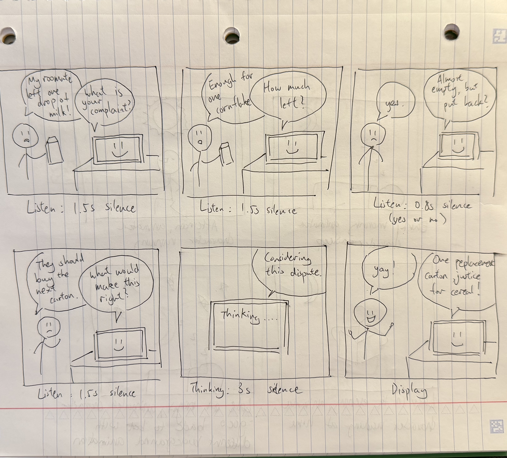
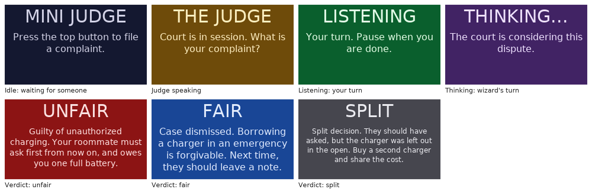
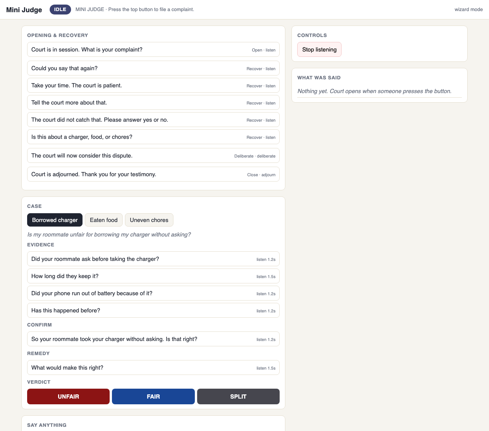

# Chatterboxes

**Collaborators:** Hong Yuan Cao hc2343, Yun-Chung Liu yl4445

# Part 1

## A. Text to Speech

Greeting script: [greet_my_name.sh](speech-scripts/greet_my_name.sh).

I used the same Piper voice as the demo for my greeting script: both sounded natural and conversational. However, compared with Piper, eSpeak and Festival sounded much more robotic. Even with the same words, the Piper greeting felt more like a person checking in with me, while the other two felt more like a machine delivering a message.

## B. Speech to Text

For my five-second recording, base.en took 0.72 seconds to load and 1.96 seconds to transcribe, with a real-time factor of 0.39x. small.en took 197.03 seconds to load and 5.66 seconds to transcribe, with a real-time factor of 1.13x. Both produced the same words, with only a punctuation difference. The small model’s startup wait was especially noticeable. Although loading happens only once in a continuously running system, its transcription was also slower without improving accuracy on this recording. I would easily choose base.en for faster startup and conversational responses.

My script uses Piper to ask “How many coffees did you drink today?” and then records a five-second response. Testing with base.en produced the transcript “1,” taking 1.66 seconds with a real-time factor of 0.33x.

## C. Turn-taking: knowing when someone has stopped talking

### Our observations

We tested silence thresholds of 0.2s, 0.4s (the default), and 1.5s using `listen.py`. These runs used the script's default `tiny.en` recognition model.

At 0.2s, the system often split our speech into short fragments instead of capturing full sentences. Pausing within a sentence could end the turn before we finished our thought, making it difficult to speak naturally. The intermediate 0.4s setting also produced many short fragments, so it did not fully solve this problem. At 1.5s, the system captured longer phrases, including hesitations and changes of thought, but required a longer wait before deciding we were finished. This gives the speaker more room to think, at the cost of making the system seem slower to respond.

We also noticed that the beginning of our speech was often missing at both short and long settings. Increasing the end-of-turn silence threshold did not resolve that observation. The transcripts alone cannot establish whether the first words were lost during audio capture, speech detection, or recognition; we would need the original audio and intended words to identify the cause.

**0.2s minimum silence:**

```text
[0.5s speech, 0.86s to transcribe]  Hello.
[0.6s speech, 0.91s to transcribe]  Are you doing?
[0.8s speech, 0.84s to transcribe]  the microphone.
[1.1s speech, 4.64s to transcribe]  We have some one refill.
[0.4s speech, 0.75s to transcribe]  Yeah.
```

**0.4s minimum silence (default):**

```text
[0.7s speech, 0.80s to transcribe]  Hello.
[0.4s speech, 0.80s to transcribe]  you.
[0.7s speech, 0.78s to transcribe]  Are you?
[0.5s speech, 0.82s to transcribe]  Eric.
[0.8s speech, 0.89s to transcribe]  How was your day?
[0.4s speech, 0.79s to transcribe]  Why?
[0.6s speech, 3.99s to transcribe]  y'all.
[1.2s speech, 6.31s to transcribe]  We will see you next time.
[0.5s speech, 0.86s to transcribe]  doesn't work.
```

**1.5s minimum silence:**

```text
[2.7s speech, 1.23s to transcribe]  And I think... No, no, I don't think I'll talk about it either.
[2.6s speech, 1.10s to transcribe]  I think I should know maybe it's September 28th something like that
[2.7s speech, 1.18s to transcribe]  That's true, we're looking at I think it's a number of times
[4.4s speech, 1.07s to transcribe]  very cool. What if I don't think that?
[1.3s speech, 0.83s to transcribe]  the air.
[0.6s speech, 0.88s to transcribe]  hungry.
[3.9s speech, 1.01s to transcribe]  very very hungry I need to eat food
[0.5s speech, 0.82s to transcribe]  No.
```

## D. Storyboard

### Tiny Court of Everyday Disputes

Our device hears small everyday complaints and gives humorous verdicts. The storyboard shows a student complaining about a roommate returning an almost-empty milk carton to the fridge. Read the panels from left to right across the top row, then the bottom row.



### Design process

We explored playful speech-device ideas and chose a tiny courtroom because it gives people a clear reason to speak while leaving room for unexpected answers.

We organized the interaction into six steps: hearing the complaint, gathering evidence, confirming understanding, asking for a solution, deliberating, and delivering a verdict. The confirmation step lets the user correct a misunderstanding before the judge decides. The milk case is one possible conversation; during role-play, the judge can follow the same structure while adapting its questions to the participant's own complaint.

### Dialogue and pauses

1. **Hear the complaint.** The judge asks, “What is your complaint?” The user answers, “My roommate left one drop of milk!” The device waits for **1.5 seconds of silence** after the answer.
2. **Gather evidence.** The judge asks, “How much left?” The user replies, “Enough for one cornflake.” The device again waits for **1.5 seconds of silence**.
3. **Confirm understanding.** The judge asks, “Almost empty, but put back?” The user says, “Yes.” For this short confirmation, the device waits for **0.8 seconds of silence**. If the user starts explaining a correction, the intended behavior is to allow the longer 1.5-second pause instead.
4. **Ask for a solution.** The judge asks, “What would make this right?” The user answers, “They should buy the next carton.” The device waits for **1.5 seconds of silence**, allowing room for a brief pause while thinking through an answer.
5. **Deliberate.** The judge says, “Considering this dispute,” and displays “Thinking…” during a deliberate **three-second pause**.
6. **Deliver the verdict.** The judge announces, “One replacement carton. Justice for cereal!” The user responds, “Yay!” The device displays the verdict.

Our listening pauses are informed by Part C, where short silence thresholds often split our speech into fragments. We chose 1.5 seconds for open-ended answers so users have more room to hesitate, and 0.8 seconds as an initial setting for a short confirmation. These thresholds measure silence after speech, not the total time allowed for an answer. The separate three-second deliberation pause creates suspense, while “Thinking…” explains why the device has not replied yet. These are proposed timings to test and adjust during the role-play, and for when we actually build this out.

## E. Acting out the dialogue

**[▶ Watch our Tiny Court role-play](https://github.com/eliu1122/Interactive-Lab-Hub/blob/Fall2026/Lab%203/Video%20of%20Raspberry%20Judge.mp4)**

Acting it out was messier than the storyboard made it look. On paper every answer is one clean line, but out loud our partner gave longer answers with pauses in the middle of them, and the confirmation step was the clearest problem: instead of just saying "yes" they started explaining, so the 0.8 second threshold we had planned would have cut them off. The three second thinking pause also felt much longer spoken than it looked in the panel, and it only worked once we said "Thinking" out loud, otherwise it just seemed like the device had frozen. The verdict, on the other hand, landed better than we expected, because saying it in a formal judge voice got a real laugh that the drawing could not show.

---

# Lab 3 Part 2

## Redesign

**1. What could be improved?**

- **Wording:** Questions now say exactly what they mean, like "Did your roommate ask before taking the charger?" instead of "How much left?"
- **Timing:** The judge waits a little longer (1.2 seconds) before deciding a yes or no answer is finished, so people are not cut off.
- **Misunderstandings:** If the judge hears nothing, it asks you to say it again. If it cannot tell whether you said yes or no, it asks again.

**2. How do people know when it is listening or thinking?**

The screen changes color and shows a word:

- **Amber, "THE JUDGE":** the judge is talking.
- **Green, "LISTENING":** your turn to talk.
- **Purple, "THINKING...":** the judge is working on your answer.

We used the screen instead of the LED because a word is clearer than a light.

**3. New script**

How a case goes:

1. Press the top button to start.
2. The judge asks for your complaint.
3. It asks a few questions about what happened.
4. It thinks for 3 seconds.
5. It gives a verdict: fair, unfair, or split.

The judge handles three kinds of complaint: a borrowed charger, eaten food, and chores. The full script is in [cases.py](mini_judge/cases.py).

**4. Input devices**

The top button on the screen starts a case, and a USB microphone hears your answers.

## Prototype

### How it works

Press the top button and the judge asks questions out loud. It listens until you pause, turns your answer into text, and moves on. It works out the type of complaint from the words you use, and decides the verdict from your yes and no answers.

It runs entirely on the Pi, using the mini screen and its button, a USB microphone, and a USB speaker. The code is in [mini_judge/](mini_judge/).

### Screen captures and video





The wizard controller image above shows the question buttons, verdict controls, and transcript area.

Video of the Mini Judge in use: https://drive.google.com/file/d/1RMILTvas-BQMBVSTVRinUnw2pYWzzAzT/view?usp=sharing

> **AI Disclaimer:** The Mini Judge code (`mini_judge.py`, `cases.py`, `autopilot.py`, and `templates/controller.html`) was partially written with help from AI (Claude Code). AI also helped format this Part 2 write-up into appropriate mark-down.

## Test the system

We tested the implemented Mini Judge with our peers Tony (yw2946) and Yuge (yx692).

### What worked well about the system and what didn't?

When the conversation stayed within the prepared script, the interaction felt like a smooth court experience. The screen states helped Tony and Yuge understand which phase they were in and what was happening. The visible distinction between speaking, listening, thinking, and delivering a verdict made the exchange easier to follow and gave the device a clear courtroom structure.

The main limitation was how strongly the experience depended on the script. It did not work well when participants moved beyond the supported scenarios or expected a response that the prepared dialogue did not cover. We had to explain how the system worked and guide them toward the kinds of interaction it could handle. That extra guidance made the conversation feel less spontaneous: participants were adapting to the system's limitations instead of freely explaining their complaint. The smooth experience therefore depended partly on knowing how to stay within its boundaries.

### What worked well about the controller and what didn't?

From the wizard's side, the controller was intuitive. I could find the next line, click its button, and let the Pi speak and advance the interaction. Having the prepared questions and verdicts available as buttons made it straightforward to operate the judge while following the conversation.

However, an easy-to-use controller did not remove the limits of the scripted dialogue. Finding the next line was simple when an answer matched the expected flow, but an unexpected answer could leave us without a suitable prepared response. Although the controller includes a free-text option, the tested experience still depended heavily on the available script. This suggests that the main improvement needed is more flexible dialogue, rather than simply adding more controls.

### What lessons can you take away from the WoZ interactions for designing a more autonomous version of the system?

The tests showed that clear turn-taking cues and flexible conversation are separate design problems. The screen successfully communicated the current phase, but participants still needed help understanding what the judge could discuss. We would keep the screen states and make the supported scope clear in the opening dialogue, so users do not need as much explanation from us before starting.

A more autonomous version should recognize when an answer does not fit the expected question, ask a relevant clarification, and give users a way to correct the judge's understanding. It should also acknowledge unsupported complaints instead of trying to force them into a prepared case. The current autonomous mode uses keywords and the first recognized yes/no word, while open-ended answers are recorded without affecting the verdict. Using the substance of those answers, including the participant's requested remedy, would make the ruling feel more connected to their actual complaint.

The goal would be to preserve the smooth, clearly signaled court experience while reducing how much participants have to follow our script. These are proposed improvements based on the trials, rather than capabilities the current prototype already has.

### How could you use your system to create a dataset of interaction? What other sensing modalities would make sense to capture?

The prototype already saves timestamped speaker/text entries in `log.jsonl` and participant utterances as WAV files. With participants' consent, we could annotate these with intended words, dispute category, recognition errors, interruptions, and the wizard's chosen response. Additional state-transition and timing logs would help separate endpointing delay from recognition and wizard response time. Synchronized video could capture facial expressions, gestures, and whether participants notice the screen cues; button-event logs could capture attempts to start or restart a case.

### Implementation limits

The autonomous judge supports charger, food, and chores keywords only. Shared costs are routed to the chores case, but its questions and verdicts are still chore-oriented. Ambiguous/no-keyword complaints trigger one clarification before dismissal; incidental keywords can still misclassify unrelated complaints. Fixed verdicts can assume facts that were never established, so this remains a playful constrained prototype. In wizard mode, a person can adapt the dialogue using the free-text control.
